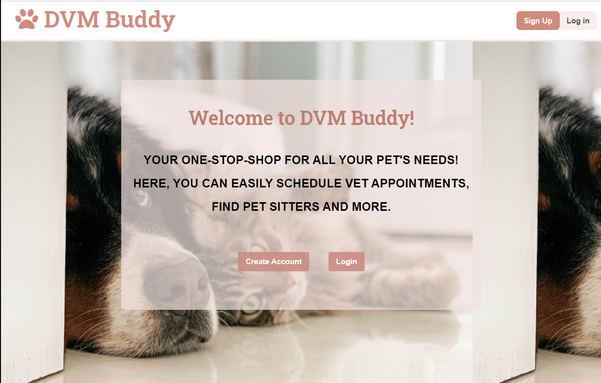
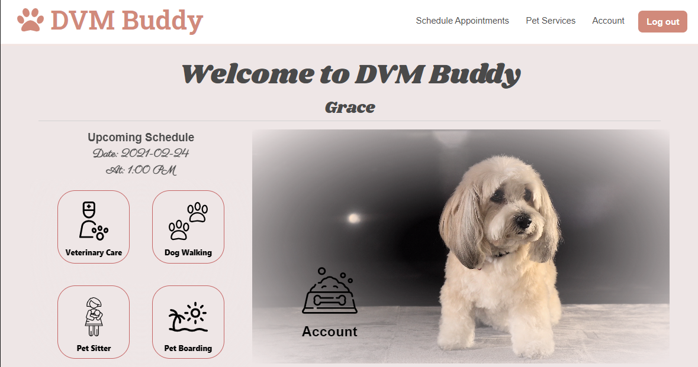
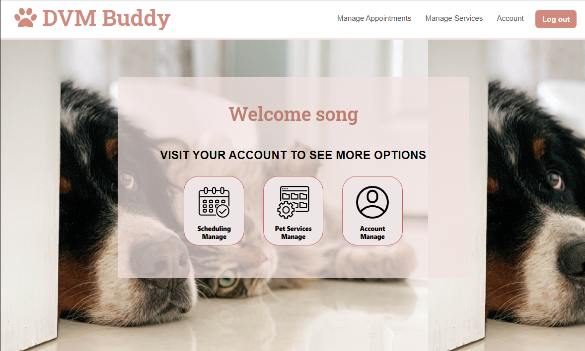

# DVM-BUDDY

The scope of this project was to create a user friendly experience for clients at their local veterinarian's office. Through this app, after a client creates an account, he/she can schedule appointments and find different service types for their pets such as walker and sitter. Through this classified section, a user can filter through the services by zipcode, distance and type of service. As an admin, he/she has access to view all the employee information, client information and upcoming appointments. In addition, the admin can create, update, and delete new reservation slots and classified cards. With this app, we hope to assist small veterinary clinics to improve their website and bring new clients in.

## Table of Contents

- [URLs](#URLs)
- [Usage](#usage)
- [Questions](#questions)
- [License](#license)

## URLs

1. Deployed URL (Heroku):
   (https://desolate-mountain-77128.herokuapp.com)

2. Github Page URL:
   [Github](https://github.com/Songhee95/dvm-buddy)

## Usage

## Questions

If you have any questions or need any help, feel free to contact me here  
Github page: [Github](https://github.com/songhee95/)  
Email: thdgml5537@gmail.com

## License

Copyright (c) 2020 SONGHEE YIM

Permission to use, copy, modify, and/or distribute this software for any
purpose with or without fee is hereby granted, provided that the above
copyright notice and this permission notice appear in all copies.

THE SOFTWARE IS PROVIDED "AS IS" AND THE AUTHOR DISCLAIMS ALL WARRANTIES
WITH REGARD TO THIS SOFTWARE INCLUDING ALL IMPLIED WARRANTIES OF
MERCHANTABILITY AND FITNESS. IN NO EVENT SHALL THE AUTHOR BE LIABLE FOR
ANY SPECIAL, DIRECT, INDIRECT, OR CONSEQUENTIAL DAMAGES OR ANY DAMAGES
WHATSOEVER RESULTING FROM LOSS OF USE, DATA OR PROFITS, WHETHER IN AN
ACTION OF CONTRACT, NEGLIGENCE OR OTHER TORTIOUS ACTION, ARISING OUT OF
OR IN CONNECTION WITH THE USE OR PERFORMANCE OF THIS SOFTWARE.
